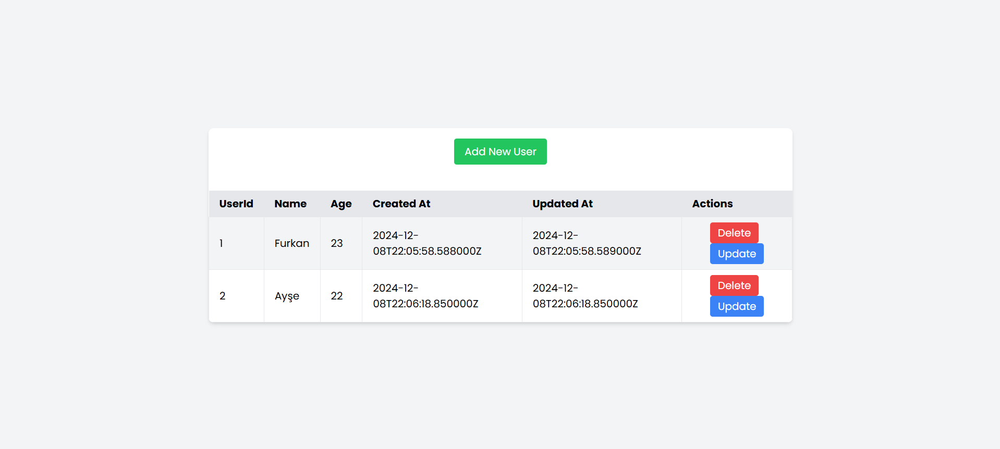
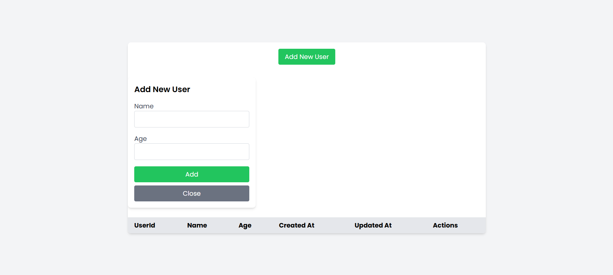
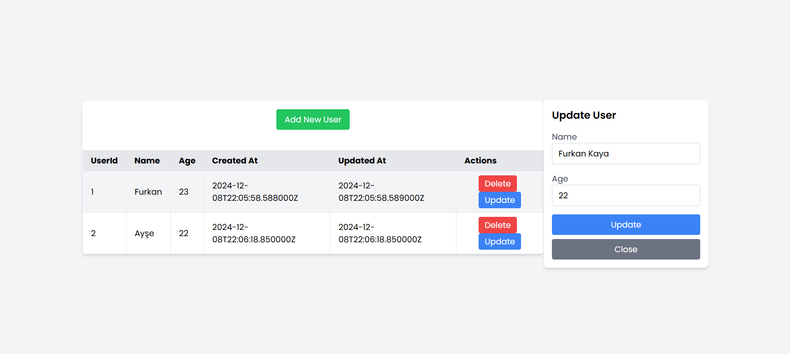
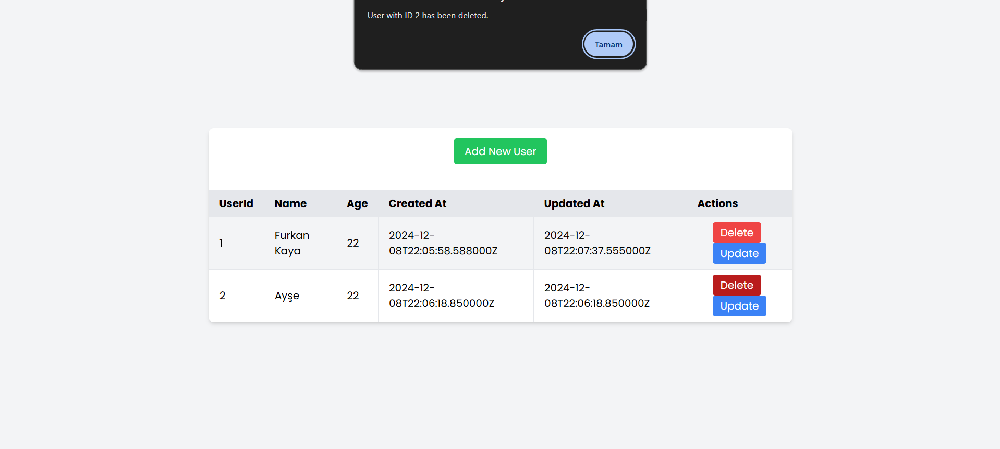
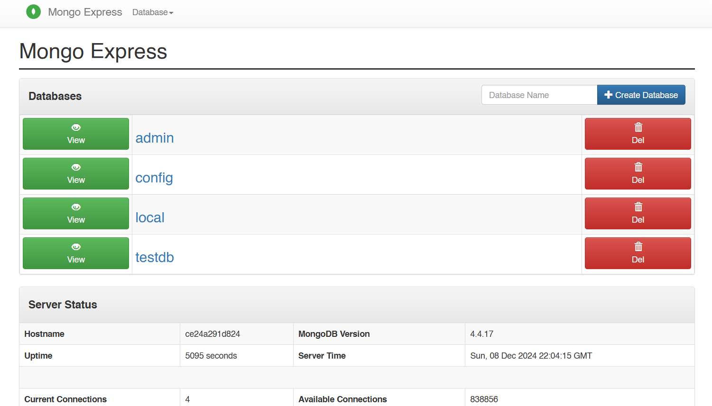

## 🍃 `Django + MongoDB + React + Docker: Full-Stack CRUD Project`

This project is a full-featured CRUD (Create, Read, Update, Delete) application built using the Django framework, MongoDB database, and Docker containerization technology. It is designed to demonstrate modern web development practices, showcasing how database operations are handled with MongoDB while providing a portable and easily deployable environment with Docker.

<hr>

<div>
<div align="center">
<h3>📋 User List </h3>

</div>

<br>

<div>

<details>
<summary>👤 Create User </summary>

</details>

<details>
<summary>✏️ Update User </summary>

</details>

<details>
<summary>🗑️ Delete User </summary>

</details>

</div>

<br>

</div>
<hr>

<div>
<div align="center">
<h3>💾 Database </h3>

</div>

<div>
<div align="center">
<h3>🐳 Docker Compose </h3>

</div>
</div>
<hr>

<br>

#### Used Technologies in The Project:

[](https://react.dev/)
[](https://www.python.org/)
[](https://www.djangoproject.com/)
[](https://www.djongomapper.com/)
[](https://www.mongodb.com/)
[](https://github.com/mongo-express/mongo-express)
[](https://docs.docker.com/)

<br>

### Requirements.txt

```txt
# Python version == 3.7.9

# Dependencies
asgiref==3.3.1
pytz==2020.5
sqlparse==0.2.4
django==3.0.5
django-cors-headers==3.7.0
pymongo==3.11.2
djangorestframework==3.12.2
djongo==1.3.3
```

<br>

### Installation

```bash
git clone https://github.com/furkankayam/fullstack-django-mongodb-docker-crud.git
```

<br>

### Usage

```bash
docker-compose up
```

<br>

### URL

#### ▶️ UI

```bash
http://localhost
```

#### ▶️ Database

```bash
http://localhost:5000/
```

<br>

# License

This project is licensed under the MIT License. See the [LICENSE](LICENSE) file for details

Created by [Mehmet Furkan KAYA](https://www.linkedin.com/in/mehmet-furkan-kaya/)
